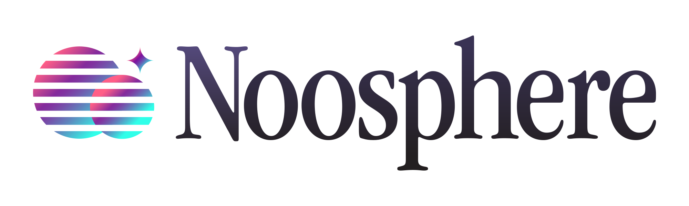

<picture>
  <source media="(prefers-color-scheme: dark)" srcset="design/images/noosphere-dark.svg">
  <source media="(prefers-color-scheme: light)" srcset="design/images/noosphere-light.svg">
  
</picture>

> Noosphere (noun):
>
> 1. Planetary consciousness. A hypothetical new evolutionary phenomena rising out of the biosphere.
> 2. A protocol for thought.

This repository contains documentation and specifications for the Noosphere
protocol. Noosphere, like its namesake, is a worldwide medium for thinking
together. We like to think of it as a protocol for thought.

Noosphere is the foundational protocol that the Subconscious app builds upon to
enable an open-ended, permissionless multiplayer experience. The documentation
and specifications in this repository are intended to enable others to
contribute to our efforts, and also to build clients and deploy infrastructure
that interoperates over Noosphere.

See [explainer](/design/explainer.md).

## Status: Discovery

We aim to build a new kind of web, but we have only begun to discover what that
means. Our work is rapidly advancing but still in-progress, and we need your
help to drive it forward!

Check out our [Roadmap][roadmap] see where we are headed.

Follow along with the daily development process on the
[Noosphere kanban][noosphere-kanban].

## Project Layout

- **[`./rust`](/rust)**: the core implementation of the Noosphere protocol as well
  as convenience abstractions and a reference client and server. Most crates can
  be compiled for native targets and/or WASM targets as desired.
- **[`./typescript`](/typescript)**: our NPM packages, which wrap
  the Rust implementation (compiled to [Web Assembly][web-assembly]) and expose
  a JavaScript API for accessing Noosphere.
- **[`./swift`](/swift)**: implementation of our Swift package, also wrapping the
  same core Rust impelementation (via a C-compatible FFI), suitable for
  incorporating Noosphere as an XCode dependency.
- **[`./design`](/design)**: documents describing Noosphere data
  structures and protocols in generalized terms.

## License

This project is dual licensed under MIT and Apache-2.0.

MIT: https://www.opensource.org/licenses/mit  
Apache-2.0: https://www.apache.org/licenses/license-2.0

[roadmap]: https://github.com/orgs/subconsciousnetwork/projects/1/views/4
[noosphere-kanban]: https://github.com/orgs/subconsciousnetwork/projects/1/views/8
[web-assembly]: https://webassembly.org/
