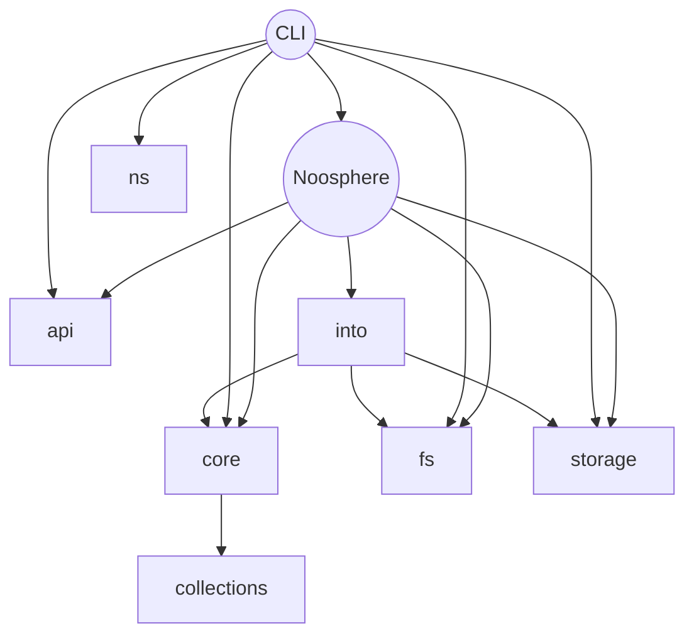

# Noosphere Rust


[](https://github.com/subconsciousnetwork/noosphere/actions/workflows/run_test_suite.yaml?query=branch%3Amain)

The core of all Noosphere-related packages in this repository is represented by
the collection of Rust packages found in this directory. If you are writing a
program in Rust and you wish to implement Noosphere within that program, you
should be able to install the packages found here directly from `cargo` on the
command line: https://crates.io/keywords/noosphere

Most other language implementations of Noosphere bind to this Rust
implementation internally, so making changes to Noosphere for a package
targetting another language will most likely involve writing some Rust.

## Rust Components



## Environment Setup

### Platform Packages

Several platform-specific dependencies are needed to build Noosphere: OpenSSL,
Protobufs, Cmake and others. You will need to make sure these packages have been
installed on your platform before you get started.

_Linux via `apt`:_

```sh
sudo apt install libssl-dev protobuf-compiler cmake jq binaryen
```

_MacOS via Homebrew:_

```sh
brew install openssl protobuf cmake jq binaryen
```

### Rust

**Importantly:** you need an up-to-date Rust toolchain. The most reliable way to
ensure you have this is to follow the instructions on https://rustup.rs/

*Minimum supported rustc version: 1.65.0*

If you wish to compile for targets other than your local platform target, you
can use rustup to get other targets easily. For example:

```sh
rustup target add wasm32-unknown-unknown
```

If you would like install the full set of targets used by this project at this
time, you can run the following:

```sh
rustup target install \
  wasm32-unknown-unknown \
  aarch64-apple-ios \
  x86_64-apple-ios \
  aarch64-apple-ios-sim \
  x86_64-apple-darwin \
  aarch64-apple-darwin
```

### Web Assembly

Finally, you should install a webdriver in order to run headless browser tests
e.g., [ChromeDriver](https://chromedriver.chromium.org/getting-started)

And then run this one-liner from the repository root to ensure you have the
correct version of `wasm-bindgen-cli`:

```sh
cargo install toml-cli && cargo install wasm-bindgen-cli --vers `toml get ./Cargo.lock . | jq '.package | map(select(.name == "wasm-bindgen"))[0].version' | xargs echo`
```

## Build Examples

_Build the project for your platform:_

```sh
cargo build
```

_Run local platform tests:_

```sh
cargo test
```

_Run browser tests in headless Chrome:_

```sh
# Change /path/to/chromedriver as appropriate for your environment
CHROMEDRIVER=/path/to/chromedriver cargo test --target wasm32-unknown-unknown
```

## Errata

Rust analyzer may have issues expanding `#[async_trait]`:

- async_trait https://github.com/rust-lang/rust-analyzer/issues/11533#issuecomment-1048439468
